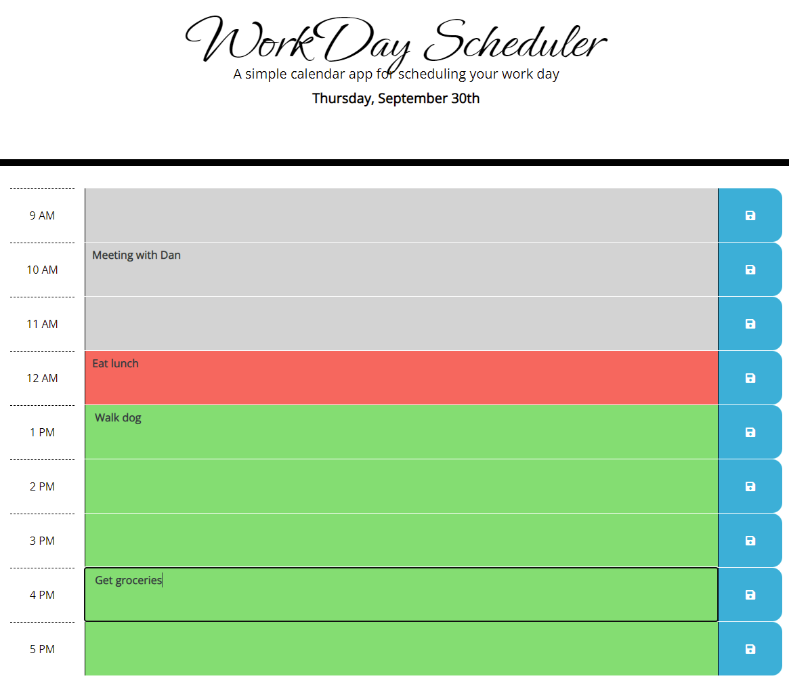

# Work Day Planner

This is a simple work day planner for recording and displaying a day's events. It features text input areas on each hour-long time block that can be saved and will persist across website visits. Additionally, each time block will be color-coded according to its relative position in time to the present: grey for the past, red for the present hour, and green for upcoming hours.

---

## Getting Started

These instructions will get you a copy of the project up and running on your local machine for development and testing purposes. See deployment for notes on how to deploy the project on a live system.

### Prerequisites

* IDE to view/edit source code (e.g. Visual Studio Code).

### Installing

1. Clone repository.
1. Open [index.html](index.html) in web browser.

### Deployment

1. Upload index.html and assets folder to webhosting site, such as GitHub.
1. If using GitHub, deploy via GitHub Pages.

---

## Built With

* [JavaScript](https://developer.mozilla.org/en-US/docs/Web/JavaScript)
* [HTML](https://developer.mozilla.org/en-US/docs/Web/HTML)
* [CSS](https://developer.mozilla.org/en-US/docs/Web/CSS)
* [GitHub](https://github.com/)

## Deployed Page

* [See Live Site](https://starryblue7.github.io/quiz-game/)

## Author

Vince Lee
- [Portfolio](https://starryblue7.github.io/portfolio/)
- [Github](https://github.com/StarryBlue7)
- [LinkedIn](https://www.linkedin.com/in/vince-lee/)

## Acknowledgments

* Custom font from [Google Fonts](https://fonts.google.com/).
